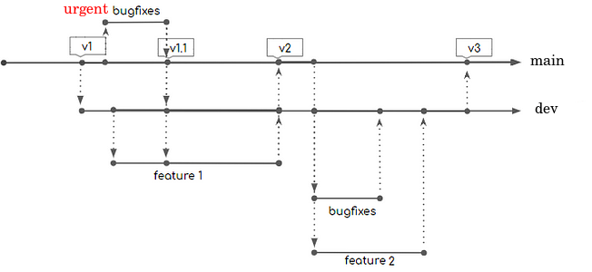

****
Code
****

To support rapid development without breaking stable versions, this project uses a two-layer branch model:

`Inspiration <https://miro.medium.com/max/700/1*2YagIpX6LuauC3ASpwHekg.png>`_

- **dev**: New features and some bug fixes are merged here. This branch allows collective testing, conflict resolution, and further stabilization before merging into the stable branch.
- **main**: Stable branch where PIP releases are created.

By default, branches target **main**, but most contributions should target **dev**. 

**Exceptions**:
Direct merges to **main** are allowed if:

- `yfinance` is massively broken
- Part of `yfinance` is broken, and the fix is simple and isolated
- Not updating the code (e.g. docs)

Creating your branch
--------------------

1. Fork the repository on GitHub. If already forked, remember to ``Sync fork``

2. Clone your forked repository:

   .. code-block:: bash

      git clone https://github.com/{user}/{repo}.git

3. Create a new branch for your feature or bug fix, from appropriate base branch:

   .. code-block:: bash

      git checkout {base e.g. dev}
      git pull
      git checkout -b {your branch}

4. Make your changes, commit them, and push your branch to GitHub. To keep the commit history and `network graph <https://github.com/ranaroussi/yfinance/network>`_ compact, give your commits a very short summary then description:

   .. code-block:: bash

      git commit -m "short sentence summary" -m "full commit message"
      # Long message can be multiple lines (tip: copy-paste)

6. `Open a pull request on Github <https://github.com/ranaroussi/yfinance/pulls>`_.

Running a branch
----------------

Please see `this page </development/running>`_.

Git stuff
---------

- You might be asked to move your branch from ``main`` to ``dev``. This is a ``git rebase``. Remember to update **all** branches involved.

  .. code-block:: bash

     # update all branches:
     git checkout main
     git pull
     git checkout dev
     git pull
     # rebase from main to dev:
     git checkout {your branch}
     git pull
     git rebase --onto dev main {your branch}
     git push --force-with-lease origin {your branch}

- ``git rebase`` can also be used to update your branch with new commits from base, but without adding a commit to your branch history like git merge does. This keeps history clean and avoids future merge problems.

  .. code-block:: bash

     git checkout {base branch e.g. dev}
     git pull
     git checkout {your branch}
     git rebase {base}
     git push --force-with-lease origin {your branch}

- ``git squash`` tiny or negligible commits with meaningful ones, or to combine successive related commits. `git squash guide <https://docs.gitlab.com/ee/topics/git/git_rebase.html#interactive-rebase>`_

  .. code-block:: bash

     git rebase -i HEAD~2
     git push --force-with-lease origin {your branch}
